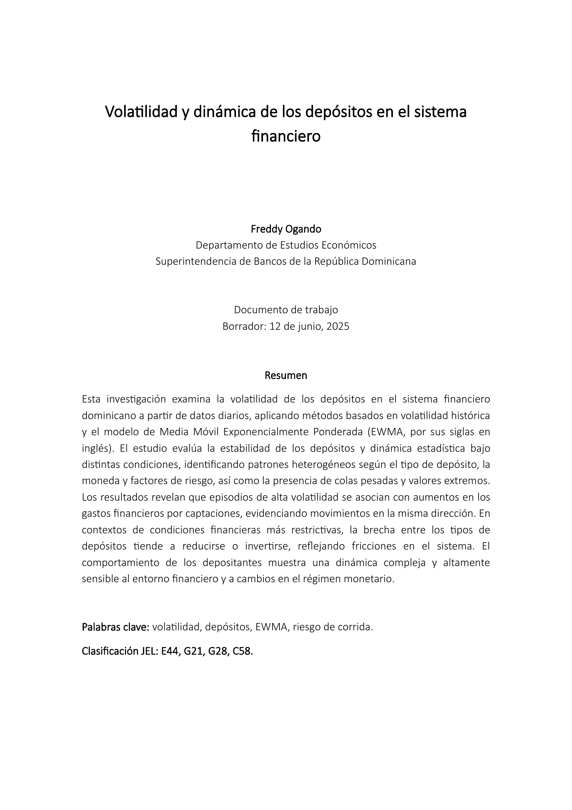
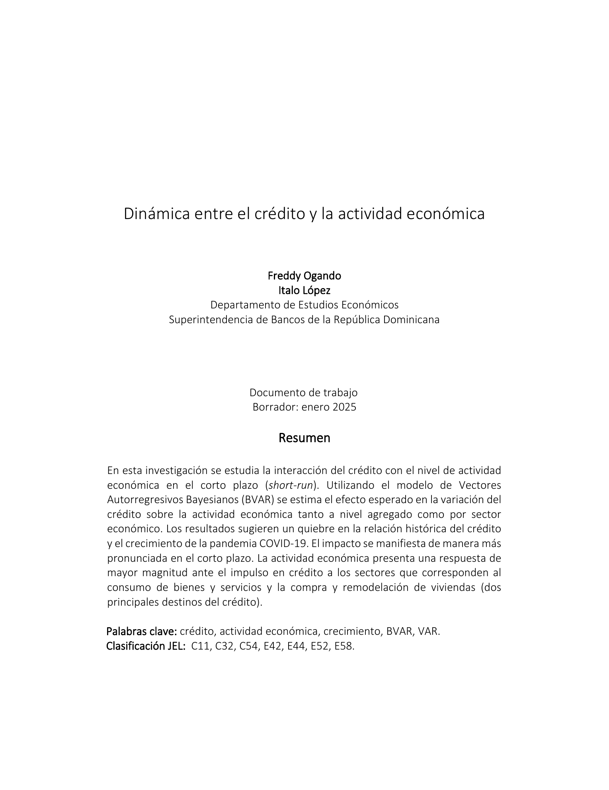
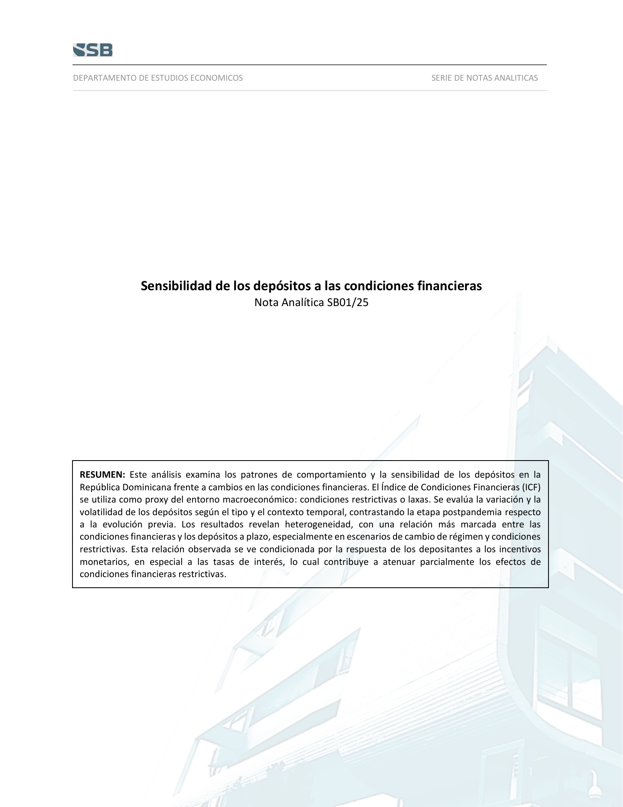

::: {.hero-block}

::: {.hero-kicker}
Quantitative Research  |  Development  |  Macro-Financial Risk
:::

# Quantitative research and computational tool development for data-driven decision-making

At the intersection of economic reasoning, applied mathematics and computer science.

:::

::: {.section-lead}
The central purpose of this space is simple: to share applied knowledge and contribute to a more rigorous understanding of macroeconomics, financial systems, and evolving risk. It is guided by the view that research and models should not only describe empirical patterns, but also explain underlying mechanisms, support decision-making, and contribute to the development of intelligent systems.
:::

<!-- ## Selected work {#selected-work .section-title} -->

<!-- ::: {.q-grid} -->

<!-- ::: {.q-card .project-card .span-6} -->
<!-- ::: {.project-meta} -->
<!-- Flagship research system -->
<!-- ::: -->

<!-- ### Macro-Financial Risk Engine -->

<!-- A reproducible platform for monitoring macro-financial stress, funding fragility, FX pressure, and policy-shock transmission using high-frequency financial and macroeconomic data. -->

<!-- - GARCH-X volatility models with exogenous macro-financial regressors. -->
<!-- - Event-study modules for monetary-policy and liquidity shocks. -->
<!-- - Rolling betas, conditional volatility dashboards, and stress indicators. -->
<!-- - Quarto reports with automated tables, figures, and executive summaries. -->
<!-- ::: -->

<!-- ::: {.q-card .project-card .span-6} -->
<!-- ::: {.project-meta} -->
<!-- Funding stability research -->
<!-- ::: -->

<!-- ### Deposit Funding Stability Lab -->

<!-- Empirical research program on deposit behavior by economic agent and currency denomination, treating daily deposit flows as informative signals of liquidity, currency preference, and risk perception. -->

<!-- - Agent-level heterogeneity: households, firms, financial sector, public sector, and non-residents. -->
<!-- - Local-currency versus foreign-currency deposit dynamics. -->
<!-- - Core, stable, and structural deposit concepts for liquidity-risk and IRRBB analysis. -->
<!-- - Confidential-data safe design using anonymized, synthetic, or public examples. -->
<!-- ::: -->

<!-- ::: {.q-card .project-card .span-6} -->
<!-- ::: {.project-meta} -->
<!-- Network econometrics -->
<!-- ::: -->

<!-- ### Systemic Risk Network Platform -->

<!-- A bank-borrower network framework for studying contagion, credit concentration, liquidity-shock propagation, and network-amplified macro-financial risk. -->

<!-- - Bipartite and projected network construction. -->
<!-- - Network-augmented local projections and event-study models. -->
<!-- - Contagion simulation and exposure concentration metrics. -->
<!-- - R/Python modules with reproducible documentation and tests. -->
<!-- ::: -->

<!-- ::: {.q-card .project-card .span-6} -->
<!-- ::: {.project-meta} -->
<!-- Quant dev portfolio -->
<!-- ::: -->

<!-- ### High-Performance Quant Toolkit -->

<!-- A modular library of numerical and statistical tools for quantitative finance: simulation, backtesting, volatility estimation, model diagnostics, and risk analytics. -->

<!-- - C++/Rcpp acceleration for Monte Carlo simulation and matrix-intensive routines. -->
<!-- - Python pipelines for feature engineering, ML signals, SHAP explainability, and backtesting. -->
<!-- - Robust software practices: CI, unit tests, benchmarks, documentation, and versioning. -->
<!-- - Clear separation between research notebooks and production-ready modules. -->
<!-- ::: -->

<!-- ::: -->

<!-- ## Technical stack {.section-title} -->

::: {.q-grid}

::: {.q-card .span-4}
### Quantitative Programming

R, C++, SQL, Python y MatLab.

Objective: build research-grade and production-oriented pipelines for data processing, signal construction, model estimation, and high-performance implementation.

:::

::: {.q-card .span-4}
### Reproducible Research Infrastructure

Quarto, Git/GitHub, LaTeX, research standards, and automated reporting.

Focus: Tools and practices for transparent, version-controlled workflows, empirical validation, and repeatable macro-financial research.

:::

::: {.q-card .span-4}
### Macro Data and Signal Modeling

Time-series, high-frequency indicators, feature engineering, backtesting, and diagnostics.

Focus: transform macro-financial information into structured indicators, predictive signals, and empirically testable insights.

:::

:::

::: {.research-hero}
## Applied Macro-Financial Risk Research

Selected technical research that I have authored or co-authored, focused on financial stability, deposit dynamics, credit conditions and macro-financial linkages.
:::

::: {.research-grid}

::: {.research-card}

::: {.research-cover-col}
[{.research-cover fig-alt="Cover page of Volatility and Dynamics of Deposits in the Financial System"}](https://sb.gob.do/publicaciones/publicaciones-tecnicas/volatilidad-y-dinamica-de-los-depositos-en-el-sistema-financiero/)
:::

::: {.research-content-col}
### 2025 — Volatility and Dynamics of Deposits in the Financial System

**Institution:** Superintendencia de Bancos de la República Dominicana  
**Author:** Freddy Ogando  
**Type:** Technical publication

This study analyzes deposit volatility in the financial system using daily data and volatility measures such as historical volatility and the EWMA model. The results show that deposit dynamics are sensitive to financial conditions, with episodes of higher volatility associated with increases in funding costs and signs of friction during restrictive financial environments.

[Official page](https://sb.gob.do/publicaciones/publicaciones-tecnicas/volatilidad-y-dinamica-de-los-depositos-en-el-sistema-financiero/){.research-link target="_blank"}  
[Download PDF](https://sb.gob.do/media/cimpg0xe/wp_fo_dynamic_of_deposits_and_volatility_v3.pdf){.research-link-secondary target="_blank"}
:::

:::

::: {.research-card}

::: {.research-cover-col}
[{.research-cover fig-alt="Cover page of Dynamics Between Credit and Economic Activity"}](https://sb.gob.do/publicaciones/publicaciones-tecnicas/dinamica-entre-el-credito-y-la-actividad-economica/)
:::

::: {.research-content-col}
### 2025 — Dynamics Between Credit and Economic Activity

**Institution:** Superintendencia de Bancos de la República Dominicana  
**Authors:** Freddy Ogando and Ítalo López  
**Type:** Technical publication

This research studies the short-run interaction between credit and economic activity. A Bayesian Vector Autoregression model is used to estimate expected effects at both the aggregate level and across economic sectors, providing evidence on how credit conditions and real activity interact over time.

[Official page](https://sb.gob.do/publicaciones/publicaciones-tecnicas/dinamica-entre-el-credito-y-la-actividad-economica/){.research-link target="_blank"}  
[Download PDF](https://sb.gob.do/media/pimifmvl/din%C3%A1mica-entre-el-cr%C3%A9dito-y-la-actividad-econ%C3%B3mica.pdf){.research-link-secondary target="_blank"}
:::

:::

::: {.research-card}

::: {.research-cover-col}
[{.research-cover fig-alt="Cover page of Sensitivity of Deposits to Financial Conditions"}](https://sb.gob.do/publicaciones/publicaciones-tecnicas/sensibilidad-de-los-depositos-a-las-condiciones-financieras/)
:::

::: {.research-content-col}
### 2025 — Sensitivity of Deposits to Financial Conditions

**Institution:** Superintendencia de Bancos de la República Dominicana  
**Author:** Freddy Ogando  
**Type:** Analytical note

This analytical note examines behavioral patterns and the sensitivity of deposits to changes in financial conditions in the Dominican Republic. The analysis contributes to understanding how depositors respond to shifts in interest rates, liquidity conditions, and broader macro-financial pressures.

[Official page](https://sb.gob.do/publicaciones/publicaciones-tecnicas/sensibilidad-de-los-depositos-a-las-condiciones-financieras/){.research-link target="_blank"}  
[Download PDF](https://sb.gob.do/media/y3qoxczu/nota_anl_sensibilidad_depositos_a_las_condiciones_fin_v2.pdf){.research-link-secondary target="_blank"}
:::

:::

:::

<!-- ## Contact {.section-title} -->

::: {.footer-cta}
##  A Software Development & Automation Workflow

Each research and share idea here is treated as a building block: a way to improve understanding, strengthen methodological rigor, and move closer to systems capable of transforming data into actionable intelligence.

:::
